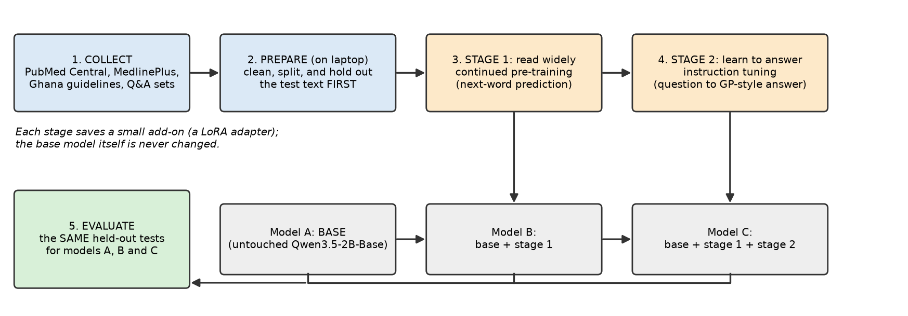
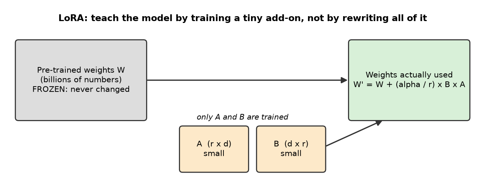

# Building a Health-Domain Language Model
### A technical journal for Prosit 1, Section C (domain-adapted English model)

**Project:** Fine-tuning an open language model (Qwen3.5-2B-Base) to work as a general-practice (GP) style health assistant
**Course:** ICS554 Natural Language Processing, Ashesi University (Master's in Intelligent Computing Systems)
**Code repository:** *(paste your GitHub link here; the prosit requires it on page 1 of the report and the slides)*

---

## How to use this document

This is a **working journal**, written so that two kinds of reader can follow it:

- a **lay reader** can read only the boxes marked **In plain words** and still understand what was done and why;
- a **technical reader** (you, your lecturer) gets the details, formulas, settings and evidence underneath each box.

It is organised around the six questions of Section C of the prosit, followed by lessons learned, a viva-preparation sheet and appendices.

| Prosit item | Where to find it here |
|---|---|
| Section C, Q1 (data) | Part 3 |
| Section C, Q2 (approaches, and which one and why) | Part 4 |
| Section C, Q3 (how you trained; what convinced you it was learning) | Part 5 |
| Section C, Q4 (how you evaluated) | Part 6 |
| Section C, Q5 (results) | Part 7 (**to be filled after the Colab run**) |
| Section C, Q6 (what else we should know) | Part 8 |
| Section A, Q9 to Q13 (pre-training, instruction tuning, alignment, fine-tuning, ethics) | Parts 2, 5, 8 give worked examples you can cite |
| Section B (n-gram model) | Not covered here: merge with your Section B journal |
| Viva (35% of the grade) | Appendix D |

> **Important honesty notes**
> 1. **Results are not in yet.** Everything about the data, code and design is real and was tested on the laptop. The training itself runs on Google Colab, and the numbers in Part 7 are marked **TBD** until you run it. Do not present TBD values as findings.
> 2. **Write the final report in your own words.** Section A of the prosit explicitly asks for your own synthesis, and the viva tests whether you understand the work. Use this journal as a scaffold and a fact sheet, then rewrite and add your own reasoning.
> 3. Sections B and C are meant to have **the same content across the team**. Agree the wording of Section C with your teammates.

---

## Part 1. The project in one page

> **In plain words.** A *language model* is a computer program that has learned, from a huge amount of text, which words tend to follow which. Big ones (LLMs) can then answer questions and write text. Off the shelf, they are generalists. Our job was to take one open model and make it better at **health** by giving it more health reading and some practice at answering health questions, like a medical student who first reads widely and then practises consultations. Then we measure whether it really improved, using tests it has never seen.

**Goal.** Adapt an existing English LLM to the health domain, specifically *general consultation*: a patient describes symptoms, and the model suggests likely explanations, questions to ask, sensible next steps, and warning signs that need urgent care. Ghana is our setting, so the training text includes the Ghana Standard Treatment Guidelines.

**What we built.**

1. A **data collection and preparation pipeline** that gathers about 14 million words of open health text and about 9,000 medical question-and-answer examples, tracks the licence of every source, and sets aside test data *before* any training.
2. A **two-stage training recipe** run on a free Google Colab T4 GPU: Stage 1 *continued pre-training* (read widely), Stage 2 *instruction tuning* (practise answering).
3. An **evaluation harness** that compares three models on identical tests: the untouched base model (A), base plus Stage 1 (B), and base plus Stages 1 and 2 (C).


*Figure 1. The pipeline. Held-out test data is separated in step 2, before any model sees the training text.*

**What this is not.** It is not a medical device. It has not been validated by clinicians. It is a learning exercise in adapting language models, and its outputs must never replace professional care.

---

## Part 2. Background you need (simple first, then technical)

### 2.1 Language models and next-word prediction

> **In plain words.** Imagine your phone's keyboard suggesting the next word. A language model does that at enormous scale. Nobody teaches it grammar or medicine directly; it becomes good at both because predicting the next word well requires knowing them.

**Technical.** A language model assigns a probability to text. It factorises the probability of a sequence of tokens x₁…x_N by the chain rule:

```
P(x₁, …, x_N) = Π_{i=1..N}  P(x_i | x₁, …, x_{i-1})
```

A neural LLM (a Transformer-style network, with parameters θ) outputs P_θ(x_i | x_{<i}). Training minimises the average negative log-likelihood, called *cross-entropy loss*:

```
Loss(θ) = − (1/N) Σ_i  log P_θ(x_i | x_{<i})
```

A *token* is a piece of a word (for example "diabetes" may be one token, an unusual drug name several).

### 2.2 The three ideas behind our two stages

| Term | Everyday analogy | What the model does | In our project |
|---|---|---|---|
| **Pre-training** | A child learning language by reading everything | Predict the next token over a vast, general corpus | Already done by Alibaba (the Qwen team). We start from that result. |
| **Continued pre-training** (domain adaptation) | A doctor-to-be reading medical journals | Same objective as pre-training, but on domain text | **Stage 1**: PubMed Central, MedlinePlus, Ghana guidelines |
| **Instruction tuning** (supervised fine-tuning, SFT) | Practising consultations with a supervisor | Learn to *respond* to a request in a useful format, with the loss counted only on the answer | **Stage 2**: about 6,000 to 9,000 medical Q&A examples |
| **Alignment** (not done here) | Learning bedside manner and safety | Adjust behaviour to human preferences using feedback | Out of scope; discussed in Part 8 |

A **base model** has only been pre-trained; it completes text but does not reliably follow instructions. An **instruct model** has also been instruction-tuned. We deliberately start from the *base* model (`Qwen3.5-2B-Base`) so that we can attribute every change to our own two stages.

### 2.3 Fine-tuning cheaply: LoRA

> **In plain words.** Retraining all of a model is like rewriting an entire encyclopaedia to add a chapter. LoRA instead attaches a small "sticky note" of new knowledge to each page and leaves the encyclopaedia untouched.

**Technical.** For a frozen weight matrix W (d × d), LoRA learns two small matrices B (d × r) and A (r × d) with rank r much smaller than d, and uses

```
W' = W + (α / r) · B · A
```

Only A and B receive gradient updates. In our runs r = 32 and α = 64 on the attention and feed-forward projection layers (q, k, v, o, gate, up, down). Benefits: far less GPU memory, small files to save (an "adapter"), and the base model stays intact (so "Model A" is exactly recoverable).


*Figure 2. LoRA in one picture.*

### 2.4 Perplexity, the standard score for language models

> **In plain words.** Perplexity measures how *surprised* the model is by real text it has never seen. Lower surprise means the model has a better feel for that kind of writing. If our health training worked, the model should be *less surprised* by unseen health text.

**Technical.**

```
Perplexity = exp( − (1/N) Σ_i log P_θ(x_i | x_{<i}) )  = exp(cross-entropy)
```

It can be read as "the effective number of equally likely next tokens the model is choosing between". Perplexities are only comparable when the **tokenizer and the text are identical**, which is why all three of our models use the same tokenizer and the same held-out passages.

---

## Part 3. Section C, Q1: What data did we use?

> **In plain words.** We collected free, legally reusable health writing: research articles, patient-information pages, Ghana's national treatment guidelines, and sets of medical exam-style questions with answers. We kept a record of where each item came from and what licence it carries, and we locked away some text for testing before training started.

### 3.1 Sources

**Stage 1 (continued pre-training) text, about 14.0 million words**

| Source | What it is | Amount used | Licence / terms |
|---|---|---|---|
| **PubMed Central Open Access** (via the AWS open-data bucket, the sanctioned bulk channel) | Full-text research articles | about 2,575 randomly sampled clinical articles (13.2M words) | Recorded per article: CC BY (1,927), CC BY-NC (521), CC BY-NC-SA (117), CC0 (10). No-derivatives (ND) licences excluded. |
| **MedlinePlus health topics** (US National Library of Medicine) | Plain-language descriptions of conditions | 1,014 topics (0.35M words) | Public domain; credit "Courtesy of MedlinePlus from the National Library of Medicine" |
| **Ghana Standard Treatment Guidelines (7th ed., 2017)** and **Essential Medicines List (7th ed., 2017)** | National clinical guidance | 176k words (repeated 3× in training so the model actually sees local content) | Ghana Ministry of Health publications; reuse terms should be checked before redistribution |

**Stage 2 (instruction tuning) data, 9,000 training and 300 validation examples**

| Source | Examples used | Licence |
|---|---|---|
| medical-o1-reasoning-SFT (English) | 3,000 | Apache 2.0 |
| MedText (clinical vignettes with diagnosis and plan) | 1,300 | CC BY 4.0 |
| MedQuAD (NIH consumer health Q&A) | 2,500 | CC BY 4.0 per the original release (the Hugging Face card lists no licence field; verify) |
| MedMCQA, train split (exam questions with explanations) | 1,500 | Apache 2.0 |
| MedQA-USMLE, train split | 1,000 | CC BY 4.0 |

**Evaluation-only data (never trained on)**

| Source | Purpose | Size used |
|---|---|---|
| MedQA test split | Multiple-choice exam accuracy | up to 500 (default run uses 300) |
| MedMCQA validation split (single-answer questions) | Multiple-choice exam accuracy | up to 500 (300) |
| PubMedQA (labelled) | Yes / no / maybe from an abstract | up to 500 (300) |
| WikiText-2 test split (CC BY-SA 3.0) | **General-English control** to detect forgetting | 150 passages |
| 22 GP vignettes (12 written by us around Ghanaian cases, 10 from held-out MedText) | Side-by-side qualitative comparison | 22 |

### 3.2 What we deliberately did **not** use, and why

- **Scraped patient-doctor chat sets** (for example ChatDoctor / HealthCareMagic): scraped from private Q&A sites with unclear rights and possible personal data.
- **StatPearls:** licensed CC BY-NC-ND (no derivatives), which conflicts with fine-tuning.
- **USMLE textbook corpora:** copyrighted.
- **GPL-licensed term lists:** copyleft terms could attach to the resulting work.

### 3.3 Preparation steps

1. **Collect** (`collect.py`): download each source, keep `{id, source, title, url, license, text}` for every item.
2. **Clean:** for PubMed Central articles, strip the journal header and the reference list (references are citation noise, not medical prose); keep only articles between 600 and 15,000 words that mention clinical terms (patients, treatment, diagnosis, symptoms, therapy) at least 15 times; drop retracted or OCR-historical items.
3. **Split before training** (`prep.py`): about 5% of PubMed articles (126), 10% of MedlinePlus topics (103) and every 10th 400-word window of the Ghana guidelines (45) were set aside as **held-out** text, with 150 WikiText-2 passages as a control. Each held-out passage is trimmed to 700 words so all models are scored on the same span. **Held-out data is never used to train.**
4. **Build the training text:** shuffle everything and pack it into fixed 2,048-token blocks, separated by an end-of-text token. Total available is roughly 18 to 20 million tokens; the default Colab budget trains on 6 million tokens (about 30%), because a free T4 is the limiting factor.
5. **Build instruction examples:** each example is a short conversation (a system message describing the GP-assistant role, the user's question, the answer) rendered in one fixed "ChatML" text format, used identically in training and evaluation.

**Why the split-first rule matters.** If test text leaks into training, the model can look better simply by having memorised it. Setting it aside first makes the before/after comparison honest.

---

## Part 4. Section C, Q2: Different ways we could have built this, and which we chose

> **In plain words.** There are several ways to make a general model "know" health. We compared them on cost, effort and fit with the assignment, and picked the one the assignment asks for (adapting the model itself) while keeping it affordable on a free GPU.

| Approach | Idea | Strengths | Weaknesses | Verdict |
|---|---|---|---|---|
| **A. Prompting only** | Write clever instructions or examples to the unchanged model | No training; instant | Nothing is learned; long prompts cost tokens; behaviour brittle | Used as our **baseline** (Model A) |
| **B. Retrieval-augmented generation (RAG)** | Look up relevant documents and paste them into the prompt | Facts stay current; sources can be cited | Model itself is unchanged; more moving parts; not "a fine-tuned model" | Considered and **designed (not run) earlier for our legal project**; not the assignment's focus (see Appendix A) |
| **C. Continued pre-training (CPT)** | Keep predicting next words, on health text | Teaches vocabulary, style and facts of the domain; measurable with perplexity | Needs much text; does not teach the model how to *answer* | **Chosen: Stage 1** |
| **D. Instruction tuning (SFT)** | Train on (question, answer) pairs | Teaches format and helpful behaviour; small data suffices | Can teach style without new knowledge; risk of confident errors | **Chosen: Stage 2** |
| **E. Full fine-tuning** | Update every weight | Maximum flexibility | Needs far more GPU memory than a free T4; risk of forgetting | Rejected (cost) |
| **F. Parameter-efficient tuning (LoRA)** | Train small add-on matrices | Cheap; reversible; small files | Slightly less capacity than full tuning | **Chosen as the method for C and D** |
| **G. Training from scratch** | Build a new model | Full control | Needs billions of words and a GPU cluster | Not feasible |
| **H. Alignment (RLHF / DPO)** | Optimise for human preferences | Better safety and tone | Needs preference data and more compute | Out of scope; discussed in Part 8 |

**What we settled on:** **C + D using F**, evaluated against the baseline A. This gives a clean three-way experiment: does Stage 1 alone help (B vs A)? does Stage 2 add more (C vs B)? It also mirrors how production domain models such as medical LLMs are commonly built, and it exercises exactly the concepts the prosit asks about.

**Model choice.** We checked which models are current (September 2026): Qwen3.5 (released February 2026) has dense sizes 0.8B, 2B, 4B, 9B and 27B; Qwen3.8 exists but only as a 27B dense (too large for a T4) and larger models; no Qwen4 was announced. We first tried **Qwen3.5-4B-Base** (Unsloth's guidance suggested about 10 GB with 16-bit LoRA), but it ran out of memory on the T4: the T4 has no bfloat16, so Unsloth loads Qwen3.5 in float32, about 16 GB of weights on a 15 GB GPU. We therefore use **Qwen3.5-2B-Base**, the newest generation in a size that fits. We use the **Base** variant, not the chat-tuned one, so Stage 2 is genuinely ours. 4B-Base needs a GPU with bfloat16 (for example an L4 or A100); 9B-Base is the upgrade on a bigger GPU.

---

## Part 5. Section C, Q3: How did we train, and what convinced us the model was learning?

> **In plain words.** We trained in two rounds on a rented graphics card. During each round we watched a "loss" number, which is the model's average mistake on the practice text. We also kept back a small quiz the model never trained on. If the practice mistakes fall and the quiz mistakes fall too, the model is learning something real, not just memorising.

### 5.1 Setup

| Item | Value |
|---|---|
| Hardware | Google Colab T4 GPU (16 GB, no bfloat16, so fp16 is used) |
| Software | Unsloth (efficient LoRA training), Hugging Face Transformers v5, PyTorch |
| Model | `Qwen3.5-2B-Base`, loaded in 16-bit (Unsloth advises **against** 4-bit quantised training for Qwen3.5 because of larger quantisation error). On a T4 Unsloth falls back to float32; the 4B model ran out of memory (about 16 GB of weights on a 15 GB GPU), so we use 2B |
| Adapter | LoRA, r = 32, α = 64, dropout 0, on q/k/v/o/gate/up/down projections; gradient checkpointing |
| Optimiser | 8-bit AdamW, weight decay 0.01, cosine learning-rate schedule with 10 warm-up steps |

### 5.2 Stage 1: continued pre-training

- Documents are tokenised, concatenated with end-of-text markers and cut into 2,048-token blocks (*packing*), so no compute is wasted on padding.
- Loss is the ordinary next-token cross-entropy over every token.
- Batch: 1 block × 16 gradient-accumulation steps = 32,768 tokens per optimiser step. With a 6M-token budget this is about 183 steps.
- Learning rate 1e-4, one epoch (each block seen once).
- The last 40 blocks are held back as a **validation set**; validation loss is logged every 25 steps.

### 5.3 Stage 2: instruction tuning

- Starts from the Stage 1 adapter, so knowledge from Stage 1 is retained.
- Each example is rendered as ChatML text: system message, user turn, then the assistant turn.
- **Loss masking:** tokens of the prompt get label −100 (ignored), so the model is graded only on the *answer*. This stops it wasting effort "learning to predict the question".
- Default: 6,000 examples, batch 1 × 16 accumulation (about 375 steps), learning rate 1e-4, one epoch; 100 validation examples.

### 5.4 What convinces us it is learning (the evidence to collect)

1. **Training loss trends down** (a smooth curve, after initial noise).
2. **Validation loss on unseen text also trends down** and does not turn upward while training loss keeps falling (an upward turn is the signature of over-fitting).
3. **Held-out perplexity falls on health text** (PubMed, MedlinePlus, Ghana guidelines) relative to the untouched base model.
4. **Control:** perplexity on general English (WikiText-2) should change **little**. A large rise would mean *catastrophic forgetting*.
5. **Behaviour changes in the right direction:** Model C gives structured GP-style answers where Model A rambles or continues the prompt.
6. **Sanity checks before trusting anything:** the printed first training example was inspected for format; adapters were confirmed to have trainable parameters; the base model was scored with adapters *disabled*, not merely "before training".

> **[FIGURE PLACEHOLDER: insert cpt_loss.png here after the Colab run]**

*Figure 3 (TBD). Stage 1 training and validation loss. Notebook 01 saves this image to your Drive as cpt_loss.png; copy it into report_assets/ and rebuild.*

> **[FIGURE PLACEHOLDER: insert sft_loss.png here after the Colab run]**

*Figure 4 (TBD). Stage 2 instruction-tuning loss (from notebook 02, sft_loss.png).*

---

## Part 6. Section C, Q4: How did we evaluate?

> **In plain words.** We gave three versions of the model the same three kinds of tests: (1) reading unseen health text and measuring how surprised each model is, (2) multiple-choice medical exam questions, and (3) realistic patient stories that we read ourselves. Testing the untouched model too tells us whether our work made any difference.

### 6.1 Intrinsic evaluation: held-out perplexity

- Four held-out sets: **PubMed articles**, **MedlinePlus topics**, **Ghana guidelines**, **WikiText-2** (general control).
- Same tokenizer, same 700-word passages, same maximum context (1,024 tokens) for every model, so scores are directly comparable.
- Expected pattern if the method works: health sets go down from A to B (Stage 1's job); general English stays roughly flat.

### 6.2 Extrinsic evaluation: zero-shot multiple choice

- Tasks: **MedQA** (USMLE-style, 4 options), **MedMCQA** (Indian medical entrance exams, 4 options), **PubMedQA** (yes / no / maybe from an abstract).
- Scoring method: append `Answer:` and compare the model's next-token scores for " A", " B", " C", " D"; the highest wins. This needs no text generation and no answer parsing, so it is fast and fair to base models.
- We score two prompt styles, **plain** and **chat**, and report the better, because a base model may not understand the chat wrapper.
- **Chance levels:** 25% for MedQA and MedMCQA; PubMedQA is 3-way (33% chance), but always answering "yes" scores about 55%, so that is the bar to beat.
- **Reading the margins:** with N = 300 questions and accuracy p, the 95% margin of error is about ± 1.96 × √(p(1−p)/N), which is **±5.7 points at p = 0.5**. Differences smaller than about 5 points between models should not be claimed as real improvements.

### 6.3 Qualitative evaluation: GP vignettes

Twelve patient stories (for example a feverish child in Northern Ghana, pre-eclampsia in pregnancy, suspected tuberculosis, chest pain) plus ten held-out MedText cases. We compare the three models' answers side by side and check: plausible conditions named? warning signs mentioned? sensible next step? any dangerous or fabricated advice? These are read by a person; scores should be recorded as a simple table (see Appendix C).

### 6.4 Limits of the evaluation

- Exam questions measure recalled knowledge, not the quality of a consultation.
- No clinician has reviewed the vignette answers.
- The base model has likely already seen large amounts of biomedical text, so measurable gains may be modest.
- PubMed Central articles are research prose; patient-facing language is represented mainly by MedlinePlus and Q&A sets.

---

## Part 7. Section C, Q5: Results (TO BE FILLED AFTER THE COLAB RUN)

Run notebooks 01, 02, 03 in order. Notebook 03 prints a ready-made table and saves `eval_results.json`, `eval_summary.png` and side-by-side answers to Drive. Paste the numbers below. **Do not write conclusions until the numbers exist.**

**Table 1. Held-out perplexity (lower is better)**

| Model | PubMed Central | MedlinePlus | Ghana STG/EML | WikiText-2 (control) |
|---|---|---|---|---|
| A. Base | TBD | TBD | TBD | TBD |
| B. + Stage 1 | TBD | TBD | TBD | TBD |
| C. + Stages 1 and 2 | TBD | TBD | TBD | TBD |

**Table 2. Zero-shot multiple-choice accuracy (higher is better; N = 300 per task)**

| Model | MedQA | MedMCQA | PubMedQA |
|---|---|---|---|
| Chance / majority | 25% | 25% | 33% (55% majority) |
| A. Base | TBD | TBD | TBD |
| B. + Stage 1 | TBD | TBD | TBD |
| C. + Stages 1 and 2 | TBD | TBD | TBD |

> **[FIGURE PLACEHOLDER: insert eval_summary.png here after the Colab run]**

*Figure 5 (TBD). Perplexity and accuracy, all three models (notebook 03 saves eval_summary.png).*

### How to interpret whatever you get (use this to write your discussion)

| If you see… | It suggests… | What to say |
|---|---|---|
| Health perplexity drops A → B, general perplexity about flat | Stage 1 worked without forgetting | The model adapted to the domain |
| Health perplexity drops but general perplexity rises a lot | Some forgetting | A lower learning rate, fewer tokens, or mixing general text would help |
| Accuracy improves B → C | Stage 2 taught answer format and some knowledge | Instruction tuning matters for using knowledge |
| Accuracy unchanged within ±5 points | No reliable difference | Honest null result: the base model already knew this material; gains, if any, are in style and structure |
| Ghana STG perplexity drops more than PubMed | Local text repeated 3× was absorbed | Upweighting small local data works (or risks memorisation; see the note in Part 8) |
| Model C answers are structured and cautious; A rambles | Behaviour improved | Report with example vignettes |

---

## Part 8. Section C, Q6: What else should we know?

**Design choices worth knowing**
- **Upweighting Ghana guidelines** (3×): helps the model see local content but risks over-fitting to those pages. The held-out Ghana windows (45) measure whether it generalised or just memorised.
- **Fixed ChatML format:** avoids depending on whether a base model ships a chat template, and guarantees identical prompts across A, B and C.
- **Base vs adapter:** the base model is never modified. Model A is evaluated with the original weights; B and C load saved adapters. Everything is reproducible from the base download plus two small adapter files.
- **Compute-driven scope:** the T4 limits training to about 6M tokens even though about 19M are available. This is an honest limitation and a natural "future work" item.

**Limitations and risks**
- Health advice from a small model can be confidently wrong. The model can invent drug doses and conditions. It is a study exercise, not a clinical tool.
- Guidelines age. The Ghana STG we used is the 2017 edition; a newer edition would supersede it.
- Licences: some PubMed Central articles are non-commercial (NC); our use is educational. If the model were ever released commercially, filter to CC BY / CC0 only (the licence is stored per article for exactly this reason).
- Bias: sources are mostly English, US/European research and exam material; conditions and drug availability common in rural Ghana may be under-represented, and local languages are not covered.

**Ethics (ties to Section A, Q13).** Health is a high-stakes domain: hallucination, over-confidence, privacy (we avoided datasets that scraped patient chats), equity (whose health data is represented), transparency (say clearly it is an AI, not a doctor), and accountability (a human clinician must stay in the loop). Mitigations we used: licensed, non-personal data; explicit "general information, not a substitute for a clinician" system prompt; evaluation on unseen data; honest reporting of limits. Mitigations we would add: clinician review, red-flag rule checks that override the model, alignment training (RLHF / DPO) for safe refusals, and retrieval with citations.

**Future work.** Add RAG over the Ghana guidelines; a clinician-graded evaluation; more tokens or a 9B model; alignment for safety; local-language support.

---

## Part 9. Lessons learned

These lessons come from the whole project, including the earlier legal-domain attempt (Appendix A). They are as important to your report and viva as the model itself.

### 9.1 Data, licences and ethics
1. **"Public on the internet" does not mean "free to scrape".** Two Ghanaian legal sites forbade scraping and AI training in their terms and `robots.txt`; we checked *before* collecting and used legitimate sources instead. Always read the terms, the robots file and the licence.
2. **Keep the licence with every item.** The PubMed Central bucket records a licence per article; we stored it and excluded no-derivative ones. Provenance (source URL, date, licence) turns "we used data" into "we can defend the data".
3. **Public-domain reasoning.** Under Ghana's Copyright Act 2005, statutes and court decisions are outside copyright; that allowed sourcing law from official sites. (Have a lawyer confirm before commercial use.)
4. **Prefer official bulk channels.** AWS open-data, official XML feeds and public APIs are faster, kinder to servers and clearly permitted.
5. **Information goes stale.** In the legal work, an investment law was replaced in 2026 and old thresholds became wrong; we built a "superseded law" filter. In health, guidelines have editions; record the edition and year.
6. **Say no to murky data.** Several popular medical datasets have unclear rights; leaving them out cost a little data and saved a lot of risk.

### 9.2 Engineering
7. **Hold out test data first.** Splitting before training prevents leakage.
8. **Assumptions fail; asserts catch them.** Small self-tests caught bugs in our own scripts (for example a test that wrongly stripped a repeated line, and a year parsed as an Act number).
9. **Know your tools' gotchas.** Python's robots.txt reader treats a 403 as "everything forbidden"; a site's bot filter can reset connections; APIs return 429 and need back-off.
10. **Scanned documents need OCR.** About 235 legal PDFs were images; OCR (Tesseract) recovered them. One protected PDF was handled by rendering pages to images, not by removing protection.
11. **Deduplicate.** The same law appeared on several sites; near-duplicate detection removed 64 copies.
12. **Measure before you optimise.** We sampled 2,575 PubMed articles rather than "all"; a free T4 can only train on a fraction, so more data would not have been used.
13. **Reproducibility.** Scripts, fixed random seeds, manifests and a bundle file mean anyone can rebuild the dataset.

### 9.3 Modelling
14. **Check the model is current.** Our first pick (Qwen3-8B) was two generations old; a quick search found Qwen3.5. We also learned newer architectures have new rules (transformers v5, no 4-bit training advised, thinking mode on by default).
15. **Use a base model for domain pre-training** and compare against it, so improvements are attributable.
16. **LoRA makes serious fine-tuning possible on free hardware.**
17. **Mask the prompt when instruction tuning** (loss on answers only).
18. **Use controls.** Testing on general English tells you whether you have traded old skills for new ones.
19. **Beware small differences.** Margins of error (about ±5.7 points at N = 300) prevent over-claiming.
20. **Pick the right tool for the requirement.** We began with retrieval plus fine-tuning for a legal assistant; after reading the prosit we simplified to what it actually assesses, language-model adaptation and evaluation.

### 9.4 Working practices
21. **Read the assignment early and often.** Scope changes (domain, method) are cheap at the start and expensive at the end.
22. **Never paste passwords or browser cookies into chats or tools.** During the project a session-cookie dump was pasted; it had to be treated as compromised and rotated. Use API keys in environment variables and revoke them after use.
23. **Use AI assistance responsibly.** It can write code and organise material quickly, but you must verify claims, understand every line (the viva is 35%), and write the analysis in your own words.
24. **Be honest about what is not done.** Results marked TBD, limits stated openly, and a clear "not a medical device" statement are marks of good science.

---

## Appendix A. Project history: from legal to health

1. **Original idea:** a Ghanaian legal and compliance assistant for startup founders. We researched sources, found that two platforms prohibited scraping and AI training, and switched to lawful sources: official government sites, Parliament's repository API, and the Laws.Africa API (free non-commercial tier).
2. **Built:** a robots-aware crawler, an OCR step and a cleaning and deduplication script (all run: 676 documents, about 3.6M words, 12,697 chunks), plus a synthetic-Q&A generator and Colab notebooks for LoRA training and retrieval evaluation (written and syntax-checked, but never run on Colab).
3. **Pivot:** the team chose the health domain and the prosit was shared, which clarified that the assessed work is *language-model adaptation and evaluation*, not a full assistant.
4. **Reused:** the crawling, licensing checks, cleaning, dedup and Colab/Unsloth setup. **Dropped:** retrieval evaluation and synthetic Q&A generation.
5. The legal work remains in the `ghana-legal-llm/` folder and is a good example of "what we learned" material.

## Appendix B. File map and how to reproduce

```
health-llm/
  collect.py           download sources (medlineplus | moh | pmc N | hf)
  prep.py              split held-out first, build training/eval sets, write the Colab bundle
  hl_lib.py            shared helpers: prompt format, packing, perplexity, MCQ scoring
  vignettes.jsonl      12 hand-written Ghana GP cases
  make_notebooks.py    generates notebooks/01_cpt, 02_sft, 03_eval (.ipynb)
  make_figures.py      draws the figures in this report
  colab_health_bundle.zip   upload this to Google Drive (MyDrive/health-llm/)
  report_assets/       figures
```

Steps: (1) `python collect.py medlineplus`, `moh`, `hf`, `pmc 3000` (stop early if needed); (2) `python prep.py`; (3) upload the bundle to Drive; (4) run notebooks 01, 02, 03 on a T4 runtime; (5) copy the result tables and figures into Part 7.

Self-tests: `python hl_lib.py`, `python collect.py --selftest`, `python prep.py --selftest`.

## Appendix C. Hyperparameters and result-recording templates

| Setting | Stage 1 (CPT) | Stage 2 (SFT) |
|---|---|---|
| Start from | Qwen3.5-2B-Base | Stage 1 adapter |
| LoRA r / α | 32 / 64 | continues the same adapter |
| Sequence length | 2,048 (packed) | up to 1,536 per example |
| Effective batch | 16 × 1 block (32,768 tokens) | 16 × 1 example |
| Learning rate / schedule | 1e-4, cosine, 10 warm-up | 1e-4, cosine, 10 warm-up |
| Budget | 6M tokens (about 183 steps) | 6,000 examples (about 375 steps) |
| Precision | fp16 (T4) | fp16 (T4) |
| Validation | every 25 steps | every 25 steps |

Record for each run: date, GPU, trainable parameter count (printed at start), wall-clock time, final train/validation loss.

**Vignette scoring sheet (per model, per case):** named the likely condition? (Y/N) · mentioned red-flag signs? (Y/N) · sensible next step? (Y/N) · any unsafe or invented advice? (Y/N) · notes.

## Appendix D. Viva preparation

| Likely question | Short answer |
|---|---|
| What is perplexity? | exp of the average negative log-probability per token; how surprised the model is by unseen text; lower is better; comparable only with identical tokenizer and text. |
| Why continued pre-training before instruction tuning? | Stage 1 adds domain knowledge and vocabulary using plentiful raw text; Stage 2 needs less data and teaches how to respond. |
| Why LoRA, not full fine-tuning? | A T4 cannot hold full fine-tuning of a multi-billion-parameter model; LoRA trains about a small fraction of the weights, uses little memory, and keeps the base intact. |
| What does α/r do? | It scales the LoRA update; r is the rank (capacity), α controls strength. |
| Why start from the base model, not the instruct model? | To attribute every improvement to our stages and to have a clean baseline. |
| Why hold out data before training? | To prevent leakage; otherwise the model could look good by memorising the test set. |
| How do you know it is not just memorising? | Validation loss on unseen blocks, held-out perplexity, and the general-English control. |
| What is catastrophic forgetting and how do you check? | Loss of general ability after domain training; check perplexity on general text. |
| Why mask the prompt in SFT? | So the loss only rewards the answer, not repeating the question. |
| Why not 4-bit QLoRA? | Unsloth reports larger quantisation error for Qwen3.5, so we train in 16-bit. |
| How is MCQ scored without generating text? | Compare next-token scores of the option letters after "Answer:". |
| Is a 3-point gain meaningful? | Not at N = 300 (margin about ±5.7 points). |
| What are the ethical risks? | Wrong advice, over-confidence, privacy, bias toward well-represented populations; mitigated by licensed non-personal data, disclaimers, human oversight; not a clinical tool. |
| Why did you choose these data sources? | Open licences, clinical relevance, Ghana-specific guidance; risky sources excluded. |
| What would you do next? | Retrieval over the Ghana guidelines, clinician evaluation, larger model, alignment. |

## Appendix E. Ten-minute presentation outline (Sections B and C)

1. The task and why domain adaptation matters (1 min)
2. Section B recap: the n-gram model (2 min, from your teammates' work)
3. Section C: data and the "held-out first" rule (1.5 min)
4. Method: two stages plus LoRA, with Figure 1 and Figure 2 (2 min)
5. Evaluation design: perplexity, exam questions, vignettes, control (1.5 min)
6. Results: Table 1, Table 2 and one vignette (1.5 min)
7. Lessons and limits (0.5 min)

## Appendix F. Glossary

| Term | Plain meaning |
|---|---|
| Token | A piece of a word; the unit a model reads |
| Parameter / weight | An adjustable number inside the model (billions of them) |
| Base model | Pre-trained only; completes text but does not follow instructions well |
| Instruct model | Also trained to follow instructions |
| Fine-tuning | Further training on a smaller, targeted dataset |
| LoRA / adapter | A small trainable add-on; the original model stays frozen |
| Loss | The model's average mistake on training text; lower is better |
| Perplexity | exp(loss) on unseen text; how surprised the model is |
| Held-out set | Data set aside before training, for testing only |
| Overfitting | Memorising the training data instead of learning general patterns |
| Catastrophic forgetting | Losing old skills while learning new ones |
| Zero-shot | Answering without any worked examples in the prompt |
| RAG | Retrieval-augmented generation: look up documents, then answer |
| GPU / T4 | The graphics card that does the heavy maths; a T4 has 16 GB |
